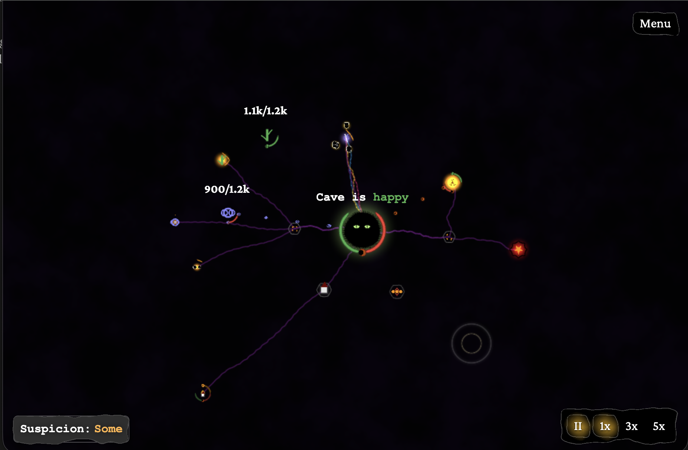
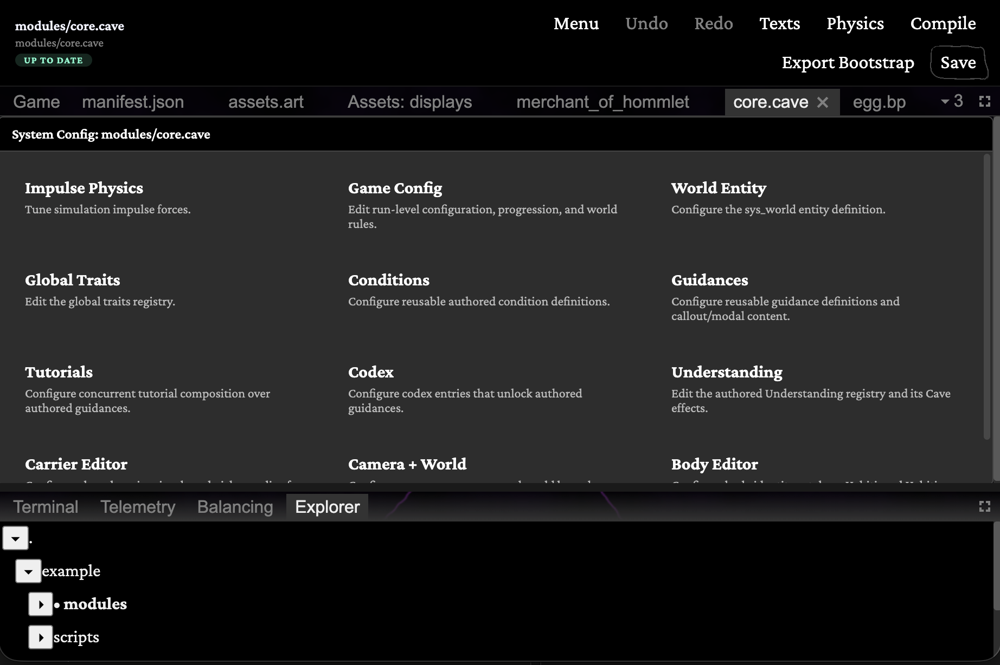

# Cave

A browser-based management and simulation game built on a custom data-driven engine — and the sandbox where I worked out how to build a large codebase end-to-end with AI coding agents.

[](LICENSE)
[](https://www.typescriptlang.org/)
[](https://vitejs.dev/)

**Play it:** https://speaks-with-stone.itch.io/cave



## What this is

Two things at once, and it helps to know which one you're looking at.

**A game.** It's finished and playable — click the link above. Content is authored as JSON blueprints with composable abilities; a compiler turns those into the runtime components that run physics, resource logistics, trait systems, and progression.

**An experiment.** Cave is written end-to-end by AI coding agents working inside a fixed architecture. I set the architecture and the gates by hand; the implementation is automated. Most of what I know about driving agents on a codebase this size came from watching it go wrong here first — some of that is written up in [docs/methodology/](docs/methodology/).

It worked as both. It is not a reference codebase, and I won't pretend otherwise: it carries the scars of an experiment run at speed — dead config, names that lie about what the code does, mechanisms that drifted away from the design they started from. [CLAUDE.md](CLAUDE.md) keeps a running list of the traps. Read it for the ideas, not the craftsmanship.

## The engine

Most of the work in Cave is in the engine, and it's the part worth looking at.

- Data-driven: every entity, ability, and system is defined in JSON and validated against Zod schemas at the boundary.
- A high-level ability language (HLL) compiles blueprints into runtime components.
- A quadtree-backed impulse engine runs the physics and spatial simulation.
- Resource logistics, trait and habitus systems, and progression are built on the same set of components.



## Getting started

```bash
npm install
cp .env.example .env   # optional: add your PostHog token for analytics
npm run dev
```

## Tech stack

- **React 19** + **Vite** (app shell and UI)
- **Phaser 3** (world rendering)
- **Zustand** + **Immer** (state management)
- **Zod** (schema validation for all engine data)
- **IndexedDB** (save persistence)
- **Custom impulse engine** (quadtree-backed physics)
- **PostHog** (optional analytics)

## Documentation

- [DSL Manual](docs/manuals/dsl_manual.md): blueprint schema, components, behavior actions, scripting language
- [Abilities Manual (HLL)](docs/manuals/hll_manual.md): the high-level ability compiler reference
- [Data Architecture](docs/manuals/data_architecture.md): design philosophy, economic model, trait and habitus systems
- [The Code Map](docs/methodology/code-map.md): the methodology that came out of the experiment — keeping codebase knowledge verified and enforceably fresh so agents stop inferring behavior from names

## Project structure

```
src/
  app-shell/     # app lifecycle, save/load
  engine/        # core simulation: linker, compiler, systems
  data/          # Zod schemas for all engine data
  game/          # game-specific logic
  ui/            # React UI (runtime, production, menus)
  lib/           # shared utilities and display logic
docs/
  phase-*/       # HLD and LLD design documents per feature phase
  manuals/       # engine reference
  methodology/   # how the AI-agent build was run
```
