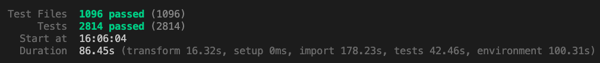
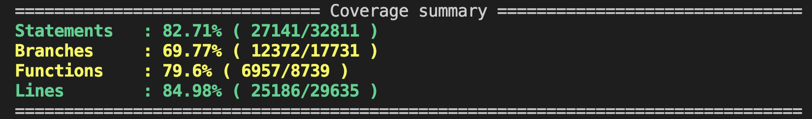
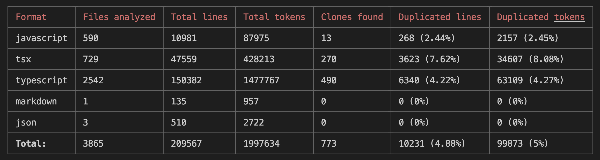

# Cave

[](LICENSE)
[](https://www.typescriptlang.org/)
[](https://vitejs.dev/)
[](docs/promo/cave-tests-run.png)
[](docs/promo/cave-coverage.png)
[](https://ftaproject.dev/)
[](https://github.com/sverweij/dependency-cruiser)

Cave is a three-month experiment in AI-driven development methodology. It consists of a custom management simulation game engine and an example narrative/simulation game built with it. The goal of the experiment was to optimize for development cost, quality, and speed using AI agents as the sole implementors — no production code was written by hand.

The `docs/` directory contains the full design record — high-level design (HLD) and low-level design (LLD) documents, organized by feature phase.

## Quality metrics

| Metric                       | Result                                              |
| ---------------------------- | --------------------------------------------------- |
| Test files / tests passing   | 1,096 / **2,814**                                   |
| Statement coverage           | **83%**                                             |
| Line coverage                | **85%**                                             |
| Average FTA complexity score | **24.4** (cyclomatic and halstead)    |
| Files scoring "OK" in FTA    | **92%** of 3,224 files                              |
| Circular dependencies        | **0** across 13,000+ import edges                   |
| Duplication (TypeScript)     | **4.2%**                                            |
| Runtime CVEs                 | **0** (all 6 audit findings are build-tooling only) |







## The project

A browser-based simulation game built on a custom data-driven engine. Entities are defined as blueprints with composable abilities; a compiler translates high-level intent into runtime components that drive physics, resource logistics, trait systems, and progression — all authored in JSON.


## Getting started

```bash
npm install
cp .env.example .env   # optional: add your PostHog token for analytics
npm run dev
```

## Tech stack

- **React 19** + **Vite** — app shell and UI
- **Phaser 3** — world rendering
- **Zustand** + **Immer** — state management
- **Zod** — schema validation for all engine data
- **IndexedDB** — save persistence
- **Custom impulse engine** — quadtree-backed physics simulation
- **PostHog** — optional analytics

## Engine documentation

- [DSL Manual](docs/manuals/dsl_manual.md) — blueprint schema, components, behavior actions, scripting language
- [Abilities Manual (HLL)](docs/manuals/hll_manual.md) — the high-level ability compiler reference
- [Data Architecture](docs/manuals/data_architecture.md) — design philosophy, economic model, trait/habitus systems

## Project structure

```
src/
  app-shell/     # app lifecycle, save/load
  engine/        # core simulation: linker, compiler, systems
  data/          # Zod schemas for all engine data
  game/          # game-specific logic
  ui/            # React UI (runtime, production, menus)
  lib/           # shared utilities and display logic
docs/
  phase-*/       # HLD and LLD design documents per feature phase
  manuals/       # engine reference documentation
```

## License

MIT
